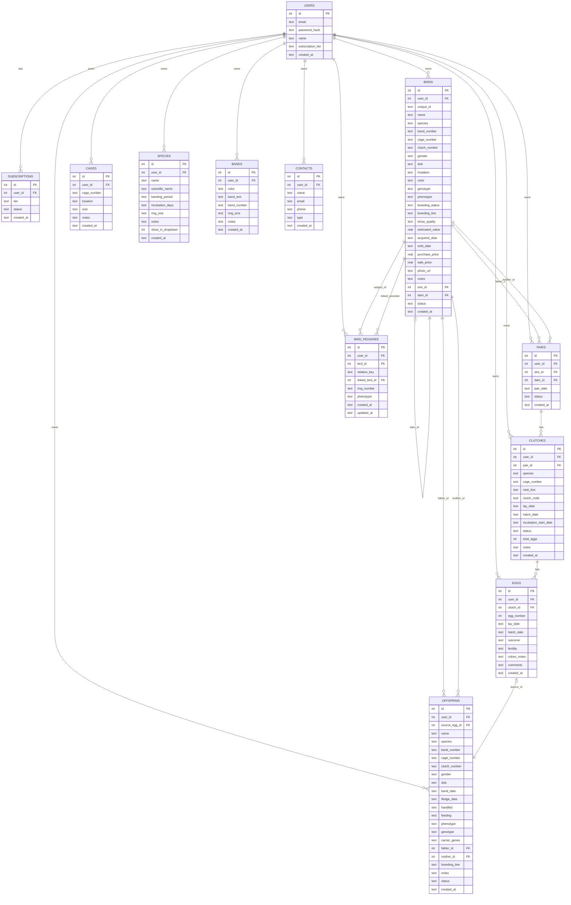

# Database Visual Diagram

Date: 2026-05-08
Status: Side-by-side visual map of the current live schema and the target Bird Tracker-style rebuild schema.

## Current live schema

## Target rebuild schema

```mermaid
erDiagram
    ACCOUNTS ||--o{ ACCOUNT_USERS : has
    ACCOUNTS ||--o{ FLOCK_MEMBERS : owns
    ACCOUNTS ||--o{ OFFSPRING_RECORDS : owns
    ACCOUNTS ||--o{ SPECIES : owns
    ACCOUNTS ||--o{ CAGES : owns
    ACCOUNTS ||--o{ RINGS : owns
    ACCOUNTS ||--o{ BREEDING_PAIRS : owns
    ACCOUNTS ||--o{ BREEDING_ROUNDS : owns
    ACCOUNTS ||--o{ BREEDING_EGGS : owns
    ACCOUNTS ||--o{ INCUBATION_RECORDS : owns
    ACCOUNTS ||--o{ CONTACTS : owns
    ACCOUNTS ||--o{ TASKS : owns
    ACCOUNTS ||--o{ CALENDAR_EVENTS : owns
    ACCOUNTS ||--o{ BIRD_EXAMINATIONS : owns
    ACCOUNTS ||--o{ BIRD_BLOODWORK : owns
    ACCOUNTS ||--o{ BIRD_HEALTH_EVENTS : owns
    ACCOUNTS ||--o{ BIRD_TRANSACTIONS : owns
    ACCOUNTS ||--o{ OFFSPRING_DISPOSITIONS : owns
    ACCOUNTS ||--o{ INVOICES : owns
    ACCOUNTS ||--o{ PRODUCTS : owns
    ACCOUNTS ||--o{ SERVICES : owns
    ACCOUNTS ||--o{ EXPENDITURES : owns

    USERS ||--o{ ACCOUNT_USERS : belongs_to

    FLOCK_MEMBERS o|--|| FLOCK_MEMBERS : father_bird_id
    FLOCK_MEMBERS o|--|| FLOCK_MEMBERS : mother_bird_id
    FLOCK_MEMBERS ||--o{ BIRD_PEDIGREE : subject_of
    FLOCK_MEMBERS ||--o{ BIRD_PEDIGREE : linked_ancestor
    FLOCK_MEMBERS ||--o{ BREEDING_PAIRS : father_in
    FLOCK_MEMBERS ||--o{ BREEDING_PAIRS : mother_in
    FLOCK_MEMBERS ||--o{ BIRD_EXAMINATIONS : examined
    FLOCK_MEMBERS ||--o{ BIRD_BLOODWORK : sampled
    FLOCK_MEMBERS ||--o{ BIRD_HEALTH_EVENTS : logged
    FLOCK_MEMBERS ||--o{ BIRD_TRANSACTIONS : transacted

    SPECIES ||--o{ FLOCK_MEMBERS : classified_as
    SPECIES ||--o{ OFFSPRING_RECORDS : classified_as
    SPECIES ||--o{ BREEDING_ROUNDS : used_in

    CAGES ||--o{ FLOCK_MEMBERS : housed_in
    CAGES ||--o{ OFFSPRING_RECORDS : housed_in
    CAGES ||--o{ BREEDING_PAIRS : used_by
    CAGES ||--o{ BREEDING_ROUNDS : used_by

    RINGS ||--o| FLOCK_MEMBERS : assigned_to
    RINGS ||--o| OFFSPRING_RECORDS : assigned_to

    BREEDING_PAIRS ||--o{ BREEDING_ROUNDS : has
    BREEDING_ROUNDS ||--o{ BREEDING_EGGS : has
    BREEDING_EGGS o|--|| OFFSPRING_RECORDS : becomes
    BREEDING_EGGS o|--|| INCUBATION_RECORDS : incubated_as
    INCUBATION_RECORDS ||--o{ INCUBATION_LOGS : has

    OFFSPRING_RECORDS ||--o{ BIRD_EXAMINATIONS : examined
    OFFSPRING_RECORDS ||--o{ BIRD_BLOODWORK : sampled
    OFFSPRING_RECORDS ||--o{ BIRD_HEALTH_EVENTS : logged
    OFFSPRING_RECORDS ||--o{ OFFSPRING_DISPOSITIONS : dispositioned

    CONTACTS ||--o{ BIRD_TRANSACTIONS : linked_to
    CONTACTS ||--o{ OFFSPRING_DISPOSITIONS : linked_to
    CONTACTS ||--o{ INVOICES : billed_to

    INVOICES ||--o{ INVOICE_ITEMS : contains
    PRODUCTS ||--o{ INVOICE_ITEMS : item_product
    SERVICES ||--o{ INVOICE_ITEMS : item_service

    ACCOUNTS {
      int id PK
      text account_name
      text subscription_plan
      text status
      text created_at
      text updated_at
    }
    ACCOUNT_USERS {
      int id PK
      int account_id FK
      int user_id FK
      text role
      bool is_account_admin
      text created_at
    }
    USERS {
      int id PK
      text email
      text password_hash
      text name
      text status
      text created_at
    }
    FLOCK_MEMBERS {
      int id PK
      int account_id FK
      text unique_id
      int ring_id FK
      int species_id FK
      int cage_id FK
      text name
      text sex
      text hatch_date
      text clutch_code
      text mutation
      text genotype
      text phenotype
      text breeding_status
      text breeding_line
      text show_quality
      real estimated_value
      text status
      text photo_path
      int father_bird_id FK
      int mother_bird_id FK
      text notes
      text created_at
      text updated_at
    }
    OFFSPRING_RECORDS {
      int id PK
      int account_id FK
      int source_egg_id FK
      int ring_id FK
      int species_id FK
      int cage_id FK
      text name
      text sex
      text hatch_date
      text ring_date
      text fledge_date
      text handfed
      text feeding_notes
      text genotype
      text phenotype
      text carrier_genes
      int father_bird_id FK
      int mother_bird_id FK
      text breeding_line
      text disposition_status
      text notes
      text created_at
      text updated_at
    }
    SPECIES {
      int id PK
      int account_id FK
      text name
      text scientific_name
      text ring_size
      text ring_period
      text incubation_days
      text fledging_period
      text maturity_period
      int show_in_dropdown
      text notes
      text created_at
    }
    CAGES {
      int id PK
      int account_id FK
      text cage_number
      text location
      text size
      text notes
      text created_at
    }
    RINGS {
      int id PK
      int account_id FK
      text color
      text ring_text
      text ring_number
      text ring_size
      text material
      text ring_type
      text notes
      int assigned_bird_id FK
      int assigned_offspring_id FK
      text created_at
    }
    BIRD_PEDIGREE {
      int id PK
      int account_id FK
      int bird_id FK
      text relation_key
      int linked_bird_id FK
      text ring_number_snapshot
      text phenotype_snapshot
      text genotype_snapshot
      text created_at
      text updated_at
    }
    BREEDING_PAIRS {
      int id PK
      int account_id FK
      int father_bird_id FK
      int mother_bird_id FK
      int cage_id FK
      text pair_date
      text status
      text notes
      text created_at
    }
    BREEDING_ROUNDS {
      int id PK
      int account_id FK
      int pair_id FK
      int species_id FK
      int cage_id FK
      text clutch_code
      text nest_box
      text date_started
      text lay_date
      text incubation_start_date
      text expected_hatch_date
      text actual_hatch_date
      int total_eggs
      text status
      text notes
      text created_at
      text updated_at
    }
    BREEDING_EGGS {
      int id PK
      int account_id FK
      int breeding_round_id FK
      int egg_number
      text lay_date
      text hatch_date
      text fertility
      text outcome
      text colour_notes
      text comments
      text created_at
      text updated_at
    }
    INCUBATION_RECORDS {
      int id PK
      int account_id FK
      int egg_id FK
      text incubator_number
      text date_set
      text fertile_flag
      text expected_hatch_date
      text status
      text notes
      text created_at
    }
    INCUBATION_LOGS {
      int id PK
      int incubation_record_id FK
      text log_date
      int day_number
      real weight
      real temperature
      real humidity
      text comments
      text created_at
    }
    BIRD_EXAMINATIONS {
      int id PK
      int account_id FK
      int flock_member_id FK
      int offspring_id FK
      text exam_date
      real weight
      text body_score
      text comments
      text treatment
      text created_at
    }
    BIRD_BLOODWORK {
      int id PK
      int account_id FK
      int flock_member_id FK
      int offspring_id FK
      text sample_date
      real glucose
      real AST
      real ALT
      real gamma
      real alk_ptse
      real CK
      real LDH
      real cholesterol
      real total_protein
      real phosphorous
      real calcium
      real sodium
      real potassium
      real chloride
      real bicarbonate
      real uric_acid
      real anion_gap
      real bile_acid
      real bilirubin
      real white_blood_cell_ct
      real hematocrit
      text morphology
      text notes
      text created_at
    }
    BIRD_HEALTH_EVENTS {
      int id PK
      int account_id FK
      int flock_member_id FK
      int offspring_id FK
      text event_type
      text event_date
      text title
      text detail_notes
      text created_at
    }
    TASKS {
      int id PK
      int account_id FK
      text target_type
      int target_id
      text periodicity
      text task_description
      real estimated_hours
      real actual_hours
      text last_completed
      text next_date
      text status
      text comments
      text created_at
    }
    CALENDAR_EVENTS {
      int id PK
      int account_id FK
      text source_type
      int source_id
      text event_date
      text title
      text event_type
      text notes
      text created_at
    }
    CONTACTS {
      int id PK
      int account_id FK
      text first_name
      text last_name
      text business_name
      text phone
      text email
      text created_at
    }
    BIRD_TRANSACTIONS {
      int id PK
      int account_id FK
      int flock_member_id FK
      int contact_id FK
      text transaction_type
      text transaction_date
      real amount
      text notes
      text created_at
    }
    OFFSPRING_DISPOSITIONS {
      int id PK
      int account_id FK
      int offspring_id FK
      int contact_id FK
      text disposition_status
      text status_date
      real sale_price
      text notes
      text created_at
    }
    INVOICES {
      int id PK
      int account_id FK
      int contact_id FK
      text invoice_number
      text invoice_date
      text status
      real total_amount
      text notes
      text created_at
    }
    INVOICE_ITEMS {
      int id PK
      int invoice_id FK
      int product_id FK
      int service_id FK
      text description
      real quantity
      real unit_price
      real total_price
      text created_at
    }
    PRODUCTS {
      int id PK
      int account_id FK
      text name
      text sku
      real default_price
      text created_at
    }
    SERVICES {
      int id PK
      int account_id FK
      text name
      real default_price
      text created_at
    }
    EXPENDITURES {
      int id PK
      int account_id FK
      text expenditure_date
      text category
      real amount
      text notes
      text created_at
    }
```

## Notes
- The current diagram reflects what is actually in the app now.
- The target diagram reflects the fuller Bird Tracker-style structure we should build toward.
- Mermaid renders nicely on GitHub and in many markdown viewers, so this is the cleanest portable visual format for now.
